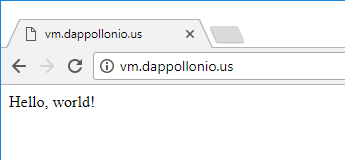

# 

<br><br>


**Patrick D'appollonio**
<small>Hewlett-Packard Enterprise USA
HPE Datacenter Care - Center of Excelence</small>

---

<!-- page_number: true -->

<div style="text-align: center">

<h2>OpenShift fundamentals</h2> 
Things you need to know to use OpenShift
</div>

---

# OpenShift?

OpenShift is an all-in-one solution to orchestrate workloads based on containers. It uses **Kubernetes** (from Google) internally as well as **Docker** to perform, among other features:

* Application builds
* Deployments
* Scaling
* Health management
* Orchestration
* Self-service platform

---

## How OpenShift works

A combination of multiple application elements makes the standard OpenShift framework. With it you can deploy Docker containers to be automatically managed by OpenShift. You'll also get some extra benefits like **if one of the OpenShift nodes goes down, the pods are going to be scheduled in a different node**.

The goal is to have Docker containers that follow the containerized mantra: **stateless applications** that use services and apps by calling their APIs.

---

<div style="text-align: center">

<h2>Docker requires a mindset change!</h2> 
</div>

---

## To Use Docker / OpenShift, we need a mindset change

Normal applications are based on the premise of single, monolithic apps with huge codebases and multiple entrypoints. Docker is a bit different: each Docker container **can only perform one operation at a time**. This operation can be running a web server, or running a database, **but not both**. 

This doesn't mean that **you can simply create a second Docker container with the Database on it**, and link them to make them think they're on the same SDN.

**There are ways to make old monolithic apps work in Docker containers**, but this is never the proper way to go: it'll make the overall process slower and painful.

---

**Docker containers are meant to be disposable :put_litter_in_its_place:**, which means you can destroy and recreate :recycle: a new one at any given time without actually affecting your workload. This also means that the application should handle shutdowns and restarts gracefully, as well as have **disposable storage** or a plan to **store data elsewhere**, and just **assume the filesystem as _read-only_**.

---

## :rotating_light: Let's say it again...

> ... the application **should handle shutdowns and restarts gracefully**, as well as have **disposable storage** or a plan to **store data elsewhere** and just **assume the filesystem as _read-only_**

---

## ... Why:interrobang:

Thinking about this approach, it makes really easy to think about container orchestration: **by having no penalty on destroying and recreating containers** orchestration becomes easy.

---

<div style="text-align: center">

<h2>Docker 101: Fundamentals</h2> 
Things you need to know to use Docker
</div>

---

## Docker philosophy

:white_check_mark: **Small, lightweight Docker containers** where each container has a single responsibility.

:white_check_mark: **Avoid multiple services within a single container**, avoiding a _single point of failure_.

:white_check_mark: Focused on a **microservices concept**: the app must be developed based on modular components.

---

## :computer: Building Docker containers

Each Docker container starts on a basic image, which is a descriptive way to define **how the platform will look**. Usually, this means starting from `scratch` -- which is the name of the most basic Docker image -- and add continuously the things we need, like folder structure, applications and everything else. 

Every time we add something to the default, basic image, we're creating a **layer** which is commited 

The Kernel for this Operating environment is provided by the **Host system**.

---

## :information_source: More technical details

Docker uses a filesystem technology called _copy-on-write_. This allows Docker to **quickly spin up Docker containers**, since the files inside the container point to the actual files in the host operating system.

Due to the filesystem mentioned above, the layers are also pointers to other copies in the filesystem. A final image **is a copy of all the combined layers in a certain point in time**: this means that even when we use the last layer actively, the contents of the previous layer remain within the same image.


---

<div style="text-align: center">

<h2>Let's work with Docker containers</h2>
</div>

---

## Example Docker container

Let's create a simple demo with a Docker container that **runs an Apache server in a Docker container**, using `debian` as a base OS. This should be the basic `Dockerfile`. Also create an `index.html` file in the same directory, with a `Hello, world!` inside:

```dockerfile
FROM debian
MAINTAINER "Patrick D'appollonio" "dappollonio@hpe.com"

RUN apt-get update && apt-get install -y apache2 \
	&& apt-get clean && rm -rf /var/lib/apt/lists/*

ENV APACHE_RUN_USER www-data
ENV APACHE_RUN_GROUP www-data
ENV APACHE_LOG_DIR /var/log/apache2

EXPOSE 80
ADD ["index.html","/var/www/html/"]

ENTRYPOINT ["/usr/sbin/apache2ctl", "-D", "FOREGROUND"]
```

---

When built by running `docker build`, we will see something like this...

```bash
$ docker build -t apache-server .
Sending build context to Docker daemon 2.048 kB
Step 1/9 : FROM debian
latest: Pulling from library/debian
c75480ad9aaf: Pull complete
Status: Downloaded newer image for debian:latest
 ---> a2ff708b7413
Step 2/9 : MAINTAINER "Patrick D'appollonio" 
           "dappollonio@hpe.com"
 ---> Running in d39942078595
 ---> f61720845da6
Removing intermediate container d39942078595
Step 3/9 : RUN apt-get update && apt-get install -y apache2 
           && apt-get clean && rm -rf /var/lib/apt/lists/*
 ---> Running in 4c3d349da87f
# wall of text removed for brevity
 ---> f07e09f2be55
Removing intermediate container 4c3d349da87f
```

---

```bash
Step 4/9 : ENV APACHE_RUN_USER www-data
 ---> Running in 4c0596830520
 ---> fb87ed5b4a10
Removing intermediate container 4c0596830520
Step 5/9 : ENV APACHE_RUN_GROUP www-data
 ---> Running in 4392c6e918ea
 ---> affed0ca64ad
Removing intermediate container 4392c6e918ea
Step 6/9 : ENV APACHE_LOG_DIR /var/log/apache2
 ---> Running in 3bacc24149d3
 ---> 7d386cdbacee
Removing intermediate container 3bacc24149d3
Step 7/9 : EXPOSE 80
 ---> Running in f3ae03b26805
 ---> d13c0b38acc4
Removing intermediate container f3ae03b26805
Step 8/9 : ADD index.html /var/www/html/
 ---> 187dbc08fba0
Removing intermediate container 5d8006768bc5
Step 9/9 : ENTRYPOINT /usr/sbin/apache2ctl -D FOREGROUND
 ---> Running in 7cd47dd6d8c0
 ---> 2e703f601881
Removing intermediate container 7cd47dd6d8c0
Successfully built 2e703f601881
```

---

## Dissecting the Output:

* The first step **pulled down the Docker `debian` image from the public [Docker Registry](https://hub.docker.com/)**.
* All the steps of the `Dockerfile` **are commited against a source control platform built-in in Docker**. This is the _copy-on-write_ technology mentioned earlier. Each commit gets a commit SHA: the first one is `a2ff708b7413`.
* Each one of the steps generates a **temporary "Docker image"** used to create that step, merged into the master flow, and then removed from the run flow -- but **not removed from the system**, to use it as a cache later on.

---

<h1 style="text-align: center">What happens if we run the same<br> <code>docker build</code> command again?</h1>

---

## It finishes pretty quickly!

```bash
Step 1/9 : FROM debian
latest: Pulling from library/debian
Status: Image is up to date for debian:latest
 ---> a2ff708b7413
Step 2/9 : MAINTAINER "Patrick D'appollonio"
           "dappollonio@hpe.com"
 ---> Using cache
 ---> 26cdb0b65b3a
Step 3/9 : RUN apt-get update && apt-get install -y apache2
           && apt-get clean && rm -rf /var/lib/apt/lists/*
 ---> Using cache
 ---> 4ae3b13c68ed
Step 4/9 : ENV APACHE_RUN_USER www-data
 ---> Using cache
 ---> fb87ed5b4a10
Step 5/9 : ENV APACHE_RUN_GROUP www-data
 ---> Using cache
 ---> affed0ca64ad
```

---

```bash
Step 6/9 : ENV APACHE_LOG_DIR /var/log/apache2
 ---> Using cache
 ---> 7d386cdbacee
Step 7/9 : EXPOSE 80
 ---> Using cache
 ---> d13c0b38acc4
Step 8/9 : ADD index.html /var/www/html/
 ---> Using cache
 ---> 187dbc08fba0
Step 9/9 : ENTRYPOINT /usr/sbin/apache2ctl -D FOREGROUND
 ---> Using cache
 ---> 2e703f601881
Successfully built 2e703f601881
```

Docker is using the **cache mechanism**, that's why it builds so quickly and each step finishes with a `Using cache` message: Each step, since we already did it and it's stored in the source control platform inside Docker **can be reused by just calling it by name** (SHA).

---

## :white_check_mark: Let's run our new server:

```bash
docker run -p 80:80 apache-server

# "-p 80:80" defines that I want to listen on the host
# machine on port 80, and route that port to the port 80
# inside the container.

# "apache-server" is the name of the docker container 
# created with "docker build"
```

Then, we can go into `http://localhost/` and see our result: the Apache2 server running in a Docker container.

---

## We can also get a terminal inside the container

Let's explore our container, make sure it's running by executing `docker ps`. You should see a container ID, say, `ac2d34e3fbcc` and a name `apache-server` after we launched it in the previous step. Grab the ID and then run the following:

```bash
$ docker exec -it ac2d34e3fbcc bash
root@ac2d34e3fbcc:/#
```

We got a prompt inside the Docker container! Let's explore a couple of things...

---

## Checking inside the container

Checking the details of the Linux distribution:
```text
# uname -a
Linux ac2d34e3fbcc 4.4.0-81-generic 104-Ubuntu SMP Wed
Jun 14 08:17:06 UTC 2017 x86_64 GNU/Linux
```

Let's also check our file we passed to the Container:
```text
# cat /var/www/html/index.html
<h1>Hello, world!</h1>
```
We can definitely modify the file:
```text
# echo "<h1>Goodbye!</h1>" > /var/www/html/index.html
```

---

## :rotating_light: ... We have one problem

By modifying the contents of the containers, since their storage is ephemeral, then the moment we exit `bash` and we don't save the changes -- commit them -- then we will lose them :put_litter_in_its_place:.

---

## :articulated_lorry: Images vs Containers

To understand how to save our changes, we need to understand first the difference between a Docker *container* and a Docker *image*.

* **A Docker container** is a running environment created from a Docker image that specifies a set of dependencies, applications and folder structure to run.
* **A Docker image** is a declarative way to construct an environment based on a description on how this looks like. 

Think about the **Docker Image** as the recipe to cook something, and the **Docker Container** being the cake already baked.

---

So, if we take our running **Docker Container** and we stop it, then we create a new one based on our **Docker Image** `apache-server` then that new container _will never have the changes we did_ to the running container, **since the "recipe" doesn't include our change**.

What we need to do is:

* Exit the container gracefully with `CTRL+pq`.
* Take the current **Container ID** (in our example, `ac2d34e3fbcc`).
* Commit the changes in `ac2d34e3fbcc` **to a new Docker Image** (each change is a new image, remember?)

<br>

```text
$ docker commit ac2d34e3fbcc server-changed
sha256:07fd4afe0955053a833de4a3f25fd234412220630484c63b49ece
```

---

**Inspecting containers running:**

```bash
$ docker ps
CONTAINER ID   IMAGE  COMMAND                 CREATED        
ac2d34e3fbcc   demo   "/usr/sbin/apache2..."  24 minutes ago

STATUS         PORTS                NAMES
Up 24 minutes  0.0.0.0:80->80/tcp   peaceful_dubinsky

# you can also print the containers stopped, by executing 
# "docker ps -a"
```

**Inspecting images created:**

```bash
REPOSITORY      TAG     IMAGE ID      CREATED         SIZE
server-changed  latest  07fd4afe0955  14 minutes ago  206 MB
apache-server   latest  2e703f601881  39 minutes ago  206 MB
debian          latest  a2ff708b7413  6 days ago      100 MB

# you can also see intermediate images (the ones used to
# build our server) by running "docker images -a"
```

---

<div style="text-align: center">

<h2>Let's play with <code>docker-http-server</code></h2> 
<a href="https://github.com/patrickdappollonio/docker-http-server">github.com/patrickdappollonio/docker-http-server</a>
</div>

---

## `docker-http-server` internals

`docker-http-server` is a container built with a bare-bones binary file, **based on the Alpine Linux distribution** -- pretty popular in the _Docker world_ due to how small it is, and how the base image is built by just copying files, which is just **one layer**.

By default, `docker-http-server` will just redirect to its Github page where the source code is stored, but, if you mount a volume inside the container, **you can serve any static file you want**, like a simple HTTP server with just one dependency: Docker.

Get the image by doing:

```bash
docker pull patrickdappollonio/docker-http-server
```

---

Now, let's use our current directory which should still have the `index.html` file with the `Hello, world!` message on it. We will mount the current directory for the Container to serve. This directory should also contain our previous `apache-server` `Dockerfile` which serves our purpose of serving static files. Let's trigger a run of our server:

```text
$ ls
Dockerfile  index.html

$ docker run -p 80:5000 -v $(pwd):/html \
      patrickdappollonio/docker-http-server
2017/06/27 15:43:03 Starting HTTP Server. Listening at 
"0.0.0.0:5000"
```

---

## :earth_americas: Opening the Browser and seeing the result:

Once we open our browser, and due to Internet standards, the first file served in an HTTP server must be `index.html` or `index.htm`. In the browser, when we point to the local machine's IP or hostname, we will see:

<p align="center"></p>

We can also inspect the `Dockerfile` by going to `127.0.0.1/Dockerfile` (or replacing `127.0.0.1` with the hostname of the machine running Docker).

---

Since this is a Docker container that prints whatever there is on the `/html` folder inside the container, but being that folder a **mounted volume** we can make changes to the content of the folder locally, and **those changes will be reflected _as soon_ as we refresh the page**. Try it!

---

<div style="text-align: center">

<h2>Exploring <code>docker-compose</code></h2> 
<a href="https://docs.docker.com/compose/">docs.docker.com/compose</a>
</div>

---

## `docker-compose`?

`docker-compose` is a simple tool that will allow us the simplicity of orchestrating Docker containers in a simple way. This tool **allows us to use YAML in a declarative way to define the state of our containers** and then execute them as instructed.

Docker for Mac, Docker for Windows and Docker Toolbox already comes with Compose inside. For Linux, **go to the Github releases page for Docker Compose and run the two commands offered there**: it'll download and move `docker-compose` to your `$PATH`.

---

## Example of a `docker-compose.yaml` file

Running our previous server is pretty simple: You just define an arbitrary name, in this case, `http-server` (it used to be called `peaceful_dubinsky` before!), the image we want to run, a port mapping as well as the volumes we will mount. We can also request the container to be restarted if it crashes for any reason...

```yaml
version: '2'

services:
  http-server: # an arbitrary name for our running container
    image: patrickdappollonio/docker-http-server
    ports:
      - 80:5000 # the port mapping specified before with "-p"
    volumes:
      - .:/html # the dot indicates the current directory
    restart: always
````

---

To run the `docker-compose` defined environment, we just do:

```text
$ docker-compose up
Creating network "development_default" with the 
default driver
Creating development_http-server_1
Attaching to development_http-server_1
http-server_1  | 2017/06/27 15:57:06 Starting HTTP Server. 
Listening at "0.0.0.0:5000"
```

Note that `docker-compose` did 3 things: 

* It created a network called `development_default`
* Created the actual container `development_http-server_1`
* Attached the output to the container `development_http-server_1`
* Run the container in the foreground, printing the `stdout` / `stderr` on screen.

---

## :mega: Software-defined Networks (SDN)

Internally, **all of the Docker orchestrators out there will create SDNs**. The networks are meant to be used for service discovery as well as name resolution if the containers are linked (not by default). 

Assuming our previous `docker-compose.yaml`, if we add another extra container, the network created between both of them **will allow them to see each other _if they're linked_:heavy_exclamation_mark:** by using the "running name" (in our case, `development_http-server_1`).

Say we have a second container named `example`. `example` can do `curl http://development_http-server_1:5000` and it'll get to our `index.html` file, using the SDN created by `docker-compose`. Still, if we try from the host machine to `curl` the container in the same way, **our computer won't know how to route that request**.

---

## Trying it out!

Update your `docker-compose.yaml` file to look like this:

```yaml
version: '2'

services:
  http-server: # an arbitrary name for our running container
    image: patrickdappollonio/docker-http-server
    ports:
      - 80:5000 # the port mapping specified before with "-p"
    volumes:
      - .:/html # the dot indicates the current directory
    restart: always

  ubuntu:
    image: demo
    restart: always
    links:
      - "http-server"
```

Then run it by executing `docker-compose up -d` (note the `-d` part!).

---

When running `docker ps`, it should show both our `patrickdappollonio/docker-http-server` running as well as our `apache-server` image. Let's get a terminal into our `apache-server` by getting the ID of the running container with `docker ps`, and then install cURL, then query our secondary container:

```text
$ docker ps
... grab the ID of the Apache server container, 
as well as the "name" of the docker-http-server,
we will assume ID "6c26e55795fa" and name 
"development_http-server_1"...

$ docker exec -it 6c26e55795fa bash

root@6c26e55795fa:/# apt update && apt install curl -y
... output ommited for brevity ...

root@6c26e55795fa:/# curl development_http-server_1:5000
Hello, world!
```

---

## :information_source: `docker-compose` allows us to create environments in an easy way

You can stop all the running containers created by `docker-compose` by running:

```bash
docker-compose down
```

`docker-compose` is the closest way to define environments similar to what OpenShift uses. But **OpenShift is heavily loaded with extra features, as well as different feature names**. Still, the features of the containerization engine works pretty much like `docker-compose`.

---

<h1 align="center">One extra example!</h1>

---

## WordPress + MySQL in `docker-compose`:

<div style="font-size: 22px">

```yaml
version: '2'

services:
  db:
    image: mysql:5.7
    volumes:
      - db_data:/var/lib/mysql
    restart: always
    environment:
      MYSQL_DATABASE: wordpressdb
      MYSQL_USER: exampleuser
      MYSQL_PASSWORD: examplepass

  wordpress:
    depends_on:
      - db
    image: wordpress:latest
    ports:
      - 80:80
    restart: always
    environment:
      WORDPRESS_DB_HOST: db:3306
      WORDPRESS_DB_NAME: wordpressdb
      WORDPRESS_DB_USER: exampleuser
      WORDPRESS_DB_PASSWORD: examplepass

volumes:
  db_data: # this will mount to a docker-configured volume
```

</div>

---


<br>

<h2 align="center">Let's talk about OpenShift :+1:</h2>

---

## :bookmark_tabs: RedHat OpenShift options:

* **OpenShift Online:** The hosted application from RedHat, you'll receive updates and patches as they come in. RedHat manages everything related to this platform so you only have to worry about your code.
 
* **Container Platform:** The Container Platform is the future plan for RedHat, even though we already have some of it in version 3.4. Managing OpenShift environments has proven difficult, overall because of **_so many different tools you need to keep it running_**, so a containerized approach makes sense as well as makes it easier to deploy and maintain.

---

* **Dedicated / Enterprise:** OpenShift Enterprise is based on the mixes of the Container Platform as well as _"Origin"_, it include some extra business features as well as support from RedHat, nice integration with other RedHat tools, as well as an streamlined installer.

* **OpenShift Origin:** Origin is the source of the whole OpenShift ecosystem. All the development happens in Origin, and then is packed and streamlined to the different ecosystems, by first being _dogfooded_ in the OpenShift online platform. Origin develops the whole process and ecosystem, **_it's free to use_ and it includes 99% of the features of OpenShift Enterprise**, with the exception of those business features that requires a RedHat subscription or they're built as paid modules by RedHat.

---

<div style="text-align: center"></div>

<p align="center">Most of the <strong><span style="color: #cc0000">OpenShift</span> features</strong> between versions use the same codebase, so most of the time <strong>using the documentation of one will give you the answers you're looking <em>for your own installation</em></strong>.</p>

---

# Components of OpenShift

A minimal OpenShift installation is based on a couple of main applications running:

* **Docker engine:** This will manage the Docker container platform, as well as the Docker Registry features.
* **Kubernetes:** The core of the platform: this is the app that will handle and manage the container lifecycle inside OpenShift. 
* **Docker registry:** It's separated from Docker, because Docker by itself doesn't include a registry server. OpenShift needs an internal OpenShift registry server to maintain a temporary copy of the builds.

---

* **Etcd:** A key-value datastore to persist certain cluster details / state across all of the OpenShift platform. 
* **OpenShift router:** The OpenShift router is based on HAProxy, it's the application running on the master nodes which will take a request from an external account and route it through the OpenShift platform directly to the container that's supposed to serve it.
* **OpenShift STI / S2I:** This is an extra feature of OpenShift called _Source-to-Image_. What it does is, given a Git repo and an unknown source code, it'll take the code, detect the stack and build the project for distribution in an appropiate way. By default, no runtime is installed, but OpenShift allows an easy way to get Java, NodeJS and Ruby.

<span style="font-size: 18px; font-style: italic">There's a [video presentation](https://access.redhat.com/webassets/avalon/v/developer_console_ose32-H264-AAC.mp4) here about how to use S2I to easily iterate building applications with OpenShift</span>

---

* **Deployer:** The _semi-HA_ feature of OpenShift is, if either a change in the codebase for an S2I project or the container / pod went down, the Deployer will redeploy a new container. This is the _stubborn_ piece of the software.
* **Docker SDN:** The software-defined network based on the Docker technology. Every time a container is created, Docker will create a software-defined network which may or may not use for communication purposes between containers. By linking two containers, you're specifying that they should resolve each other by container name as the host name.
* **Authentication:** The current OpenShift authentication is based on `HTPasswd` which you can use to create development accounts in the OpenShift installation.

---

* **Web Console:** The Web Console is the easy-to-use way to manage the OpenShift installation. You can do any development task from the UI, like deploying new code, manage the number of pods running (upscaling / downscaling) as well as URI Endpoints for running pods.
* **The `oc` command:** The `oc` command is a CLI application to manage both the development flow as well as the administration flow of OpenShift. The `oc` command is the most complete way of OpenShift administration and automation.
* **REST API:** To extend the power of the OpenShift platform, OpenShift also has an API you can use for things like deployments, S2I and so on.

---

## :information_source: A side comment...

From now on, we will use the word _"pod"_ interchangeably with "container"... **A "pod" is the name Kubernetes gives to Docker containers being orchestrated by the Kubernetes scheduler**. 

Additionally **we will be using an <span style="color:red; text-decoration: underline">_OpenShift Origin_</span> instance to run some commands and execute some actions**. It's usually safe to assume though that most of the OpenShift Enterprise features are available in Origin. After all, Enterprise _is just a fork_ with Business Capabilities and better support than Origin.

---

<div style="text-align: center">

<h2>OpenShift CLI tools</h2> 
</div>

---

## :floppy_disk: CLI tools

Openshift **includes a series of CLI tools that can be used to manage and control the OpenShift environment**. As an OpenShift administrator, having control of the whole environment in your fingertips is essentially what you need to keep operations working. 

There's going to be two CLI tools we will use during this training: the `oc` tool and the `oadm` tool. 

The `oc` tool manages and control all areas related to OpenShift management, **such as project, applications and routes**.

The `oadm` tool is used on **more advanced tasks related to the OpenShift internals**, such as the router or the private registry, as well as giving certain apps some extra "powers" based on the administrative privileges it'll have.

---

## Getting familiar with the OpenShift installation

Depending on the installation method, OpenShift may have been installed **using bare-bones configuration using the `openshift` CLI application**, or using **the Ansible installer** which generates most of the configuration for you, by offloading the proper parameters to the `openshift` app.

In any case, there will be a configuration folder with all the OpenShift parameters. Usually, the common locations for these settings are:

* **Container platform:** `/opt/openshift/master.local.config/`
* **Enterprise:** `/etc/openshift/master/` or `/etc/origin/master/`
* **Origin:** `/etc/origin/master/` (Ansible), `/opt/openshift/` (self)

---

There's an _ongoing effort_ to **centralize all of them in a single** place no matter what version of OpenShift you have installed. From now on, we will call the config folder `$OPENSHIFT_CONFIG`.

Inside the `$OPENSHIFT_CONFIG` there will be two main useful files:

* The OpenShift Master configuration file, `master-config.yaml`: **This file holds the entire OpenShift configuration**, from endpoints to access control to routing. We will be working with this file a lot.
* An `admin.kubeconfig` configuration file: Whenever you're working with OpenShift as an administrator, **you need to log in into the cluster using the Kubernetes certificates**, stored on this file.

---

## :key: Logging in as the OpenShift Administrator

By default, and not even considering the login strategy -- more on this later -- **there's one user account already set up to manage the OpenShift installation**. This account is called `system:admin` -- and you'll note later on that all administrative accounts have the `x:y` notation, separated by a colon.

The issue? :heavy_exclamation_mark: **There's no password to log in to it**. So in order to log in as `system:admin` -- which we will call "OpenShift Administrator" from now on -- **you'll have to give the OpenShift `oc` client the Kubernetes certificates**.

To log in, use:

```bash
$ oc login -u system:admin \
	--config=$OPENSHIFT_CONFIG/admin.kubeconfig
```

---

When logged in as `system:admin`, you'll be greeted with something like this:

```text
Logged into "https://master.example.com:8443" as 
"system:admin" using existing credentials.

You have access to the following projects and can 
switch between them with 'oc project <projectname>':

  * default
    kube-system
    logging
    management-infra
    openshift
    openshift-infra

Using project "default".
```

Most of the alleged "projects" here are just OpenShift / Kubernetes internals that **it's advisable to never touch, unless you really know what you are doing**. 

---

## Types of OpenShift accounts

There are 7 different account types in OpenShift, called **"roles"**:

1. **`admin`:** A project manager. An admin user will have rights to view any resource in the project and modify any resource in the project except for quota.
2. **`basic-user`:** A user that can get basic information about projects and users.
3. **`cluster-admin`:** A super-user that can perform any action in any project. They have full control over quota and every action on every resource in the project.
4. **`cluster-status`:** A user that can get basic cluster status information.

---

5. **`edit`:** A user that can modify most objects in a project, but does not have the power to view or modify roles or bindings.
6. **`self-provisioner`:** A user that can create their own projects.
7. **`view`:** A user who cannot make any modifications, but can see most objects in a project. They cannot view or modify roles or bindings.

An OpenShift administrator can add and remove multiple roles to specific users with the `oadm` command:

```bash
oadm policy add-role-to-user <role> <username>
oadm policy remove-role-from-user <role> <username>
```

---

Sometimes, the "roles" can be given for an specific project or like in the case of the `view` role, **you might want to extend it to all available projects**. Depending on this kind of broadness, a given user can have either "local policies" or "cluster policies":

* **Local Policies:** Roles that are scoped to a given project. Roles that exist only in a local policy are considered _local roles_. 
* **Cluster Policies:** Roles that are applicable across all projects. Roles that exist in the cluster policy are considered _cluster roles_.

To add cluster roles to a given user, you can execute, similar as before:

```bash
oadm policy add-cluster-role-to-user <role> <username>
oadm policy remove-cluster-role-from-user <role> <username>
```

---

Finally, you can also create your own roles, but that goes out of the scope of this training. Proper documentation and _how-tos_ are available [in the OpenShift documentation](https://docs.openshift.org/latest/admin_guide/manage_authorization_policy.html#manage-authorization-policy-creating-local-role) website.

Custom roles are based on verbs and actions against a project or cluster, but they require modifying an knowing the YAML specification for each action.

---

## :closed_lock_with_key: Configuring user accounts and logging in

OpenShift by default uses a login strategy called `AllowAll`. It essentially means that :rotating_light: **anyone using an arbitrary username and password can log in** as a basic user, create projects and manage them, as well as implement things like pod management -- confined to its own project / namespace -- or build control.

When setting it up, the new login mechanism, the most basic one recommended by RedHat is `HTPasswd`. **It uses the Apache authentication methodology** which is a file stored on the master filesystem which contains username and hashed passwords, one per line.

---

A simple `htpasswd` file looks like this:

```htpasswd
developer:$apr1$/G3YyYZt$glgEKoCYXS0QKwxV8gAoc.
developer2:$apr1$dNzEE.q3$qfhN1eKI5jSNr0zaQ2J/g.
developer3:$apr1$9fXKJsKp$QJn24LrSJlK.xMsxyWdV21
```

You can remove the lines related to an specific user to prevent them from accessing the platform. 

A word of caution though: authentication and authorization _are technically separated_. In different words, removing an user account **will not force him to log out** since it's already authenticated inside OpenShift.

To remove his privileges from the OpenShift environment, **_before_ or _after_ you remove the entry from `htpasswd`**, you can execute the `oadm` command:

```bash
oadm policy remove-user <username>
```

--- 

## Managing the Login Strategies in OpenShift

Like I mentioned before, **the standard OpenShift installation allows anyone to Log In**. This is usually intentional to allow closed, internal platforms to quickly iterate and develop new features quickly. The configuration at `$OPENSHIFT_CONFIG/master-config.yaml` looks like this:

```yaml
oauthConfig:
  ...
  identityProviders:
  - challenge: true
    login: true
    mappingMethod: claim
    name: anypassword
    provider:
      apiVersion: v1
      kind: AllowAllPasswordIdentityProvider
```

---

Implementing the new `HTPasswdIdentityProvider` which is built-in in OpenShift **is as easy as changing the configuration parameters**:

```yaml
oauthConfig:
  ...
  identityProviders:
  - challenge: true
    login: true
    mappingMethod: claim
    name: demo_htpasswd_provider 
    provider:
      apiVersion: v1
      kind: HTPasswdPasswordIdentityProvider
      file: /etc/origin/master/htpasswd
```

Note that there's a `file` configuration which points to the `htpasswd` file we will set up now. Changing the `identityProviders` settings require an OpenShift master restart so you can issue a `systemctl restart origin-master` to apply the changes.

---

## :closed_lock_with_key: Creating a developer account

Let's create a developer account in OpenShift. Since our OpenShift installation has already configured the `HTPasswd` login strategy then we will add the new users we want them to log in. 

First, we need to install the `httpd-tools` which include the `htpasswd` application: `yum install httpd-tools`, then, let's go ahead and create the `developer` account with password `oc2017`:

```bash
$ htpasswd -c $OPENSHIFT_CONFIG/htpasswd developer
New password:
Re-type new password:
Adding password for user "developer"
```

You'll see that `htpasswd` will prompt you for the password.

---

Now let's check our work, by checking that, effectively, **the user account _did got_ registered**:

```bash
$ cat $OPENSHIFT_CONFIG/htpasswd
developer:$apr1$/G3YyYZt$glgEKoCYXS0QKwxV8gAoc.
```

To add more accounts, you can run the same command as before, just omitting the `-c` flag, which stands for "create":

```bash
$ htpasswd $OPENSHIFT_CONFIG/htpasswd developer2
New password:
Re-type new password:
Adding password for user "developer2"

$ cat $OPENSHIFT_CONFIG/htpasswd
developer:$apr1$/G3YyYZt$glgEKoCYXS0QKwxV8gAoc.
developer2:$apr1$dNzEE.q3$qfhN1eKI5jSNr0zaQ2J/g.
```

---

To delete accounts, you can:

* Edit the file and remove the line where the user is declared
* Run `htpasswd -D $OPENSHIFT_CONFIG/htpasswd <user>`

Remember that by removing them here **it won't log them out from their current session**, you should also remove their privileges by issuing:

```bash
oadm policy remove-user <user>
```

---

## :key: Login in as an User without being in the Master

The last step of managing accounts is **allowing other users to log in from their workstations with ease**. This is pretty simple because everything happens using the CLI tool `oc`. Depending on your login strategy, sometimes it's possible to log in with a Token, but given our `HTPasswd` authentication, **we will log in with plain username and password, then exchange those for a token**.

The first thing we need though is to download the CLI tools. To do so, you can download them from the OpenShift Origin Github page, at [github.com/openshift/origin/releases/latest](https://github.com/openshift/origin/releases/latest). The file you need is the `openshift-origin-client-tools`. Download the zip for your platform, extract it and move the `oc` binary somewhere in your `$PATH`.

--- 

Once you have the `oc` binary for your platform, we can log in remotely:

```text
$ oc login -u developer https://master.example.com:8443
The server uses a certificate signed by an unknown authority.
You can bypass the certificate check, but any data you send 
to the server could be intercepted by others.
Use insecure connections? (y/n): y

Authentication required for https://master.example.com:8443 
(openshift)
Username: developer
Password: ******
Login successful

You don't have any projects. You can try to create a new
project, by running

    oc new-project <projectname>

Welcome! See 'oc help' to get started.
```

---

Since **the OpenShift installation uses a :page_with_curl: self-signed certificate created during the installation**, we get the message regarding this, which we can discard for now. [You can customize the certificate later on](https://docs.openshift.com/enterprise/3.1/install_config/certificate_customization.html) by changing the settings in the `$OPENSHIFT_CONFIG/master-config.yaml` file, `servingInfo` section.

The login flow also tells us we have _no_ projects which we will address shortly. To log out, you can easily do `oc logout` and it'll remove any tokens stored locally.

---

## :open_file_folder: Creating OpenShift projects

An OpenShift project is the minimal object that holds a set of OpenShift elements needed to run our applications. **A project also serves as a namespace** to control and manage all the applications created inside the project.

We already saw when logging in that creating projects is easy, you just have to execute:

```bash
$ oc new-project <project-name>
```

---

Let's create a demo project to toy with. Issue the following command:

<div style="font-size: 22px">

```bash
$ oc new-project demo
Now using project "demo" on server "https://master.example.com:8443".

You can add applications to this project with the 'new-app' command. 
For example, try:

   oc new-app centos/ruby-22-centos7~https://github.com/openshift/ruby-ex.git

to build a new example application in Ruby.
```

</div>

You'll also see that OpenShift offers you a boilerplate example, **a Ruby on Rails app with a MySQL database you can deploy in one command**. This little example here has _way more features_ that we would expect to see in a first glance, so we won't run that command yet.

And just as a reminder, you can change projects by running `oc project <project-name>`.